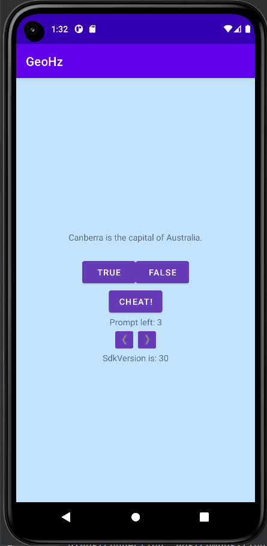
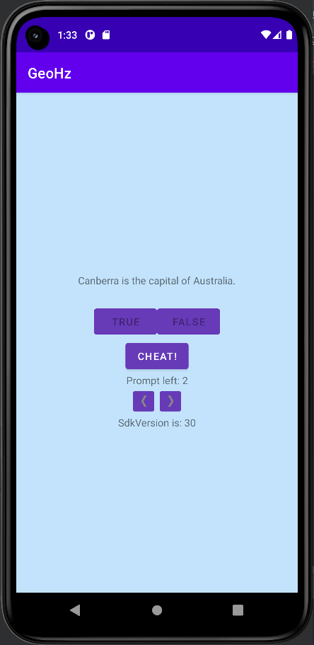
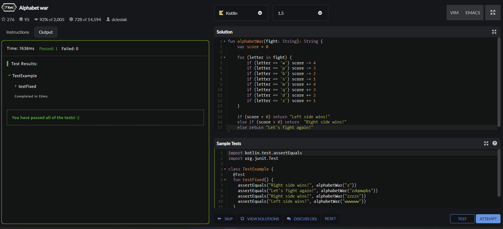
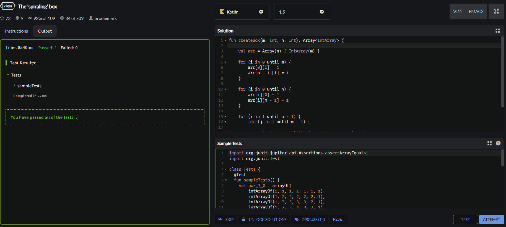
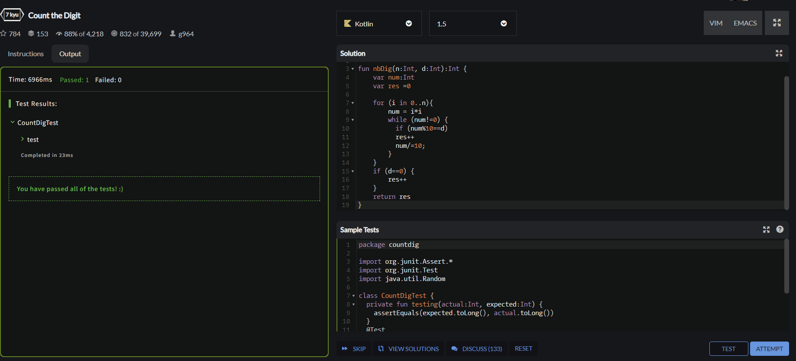
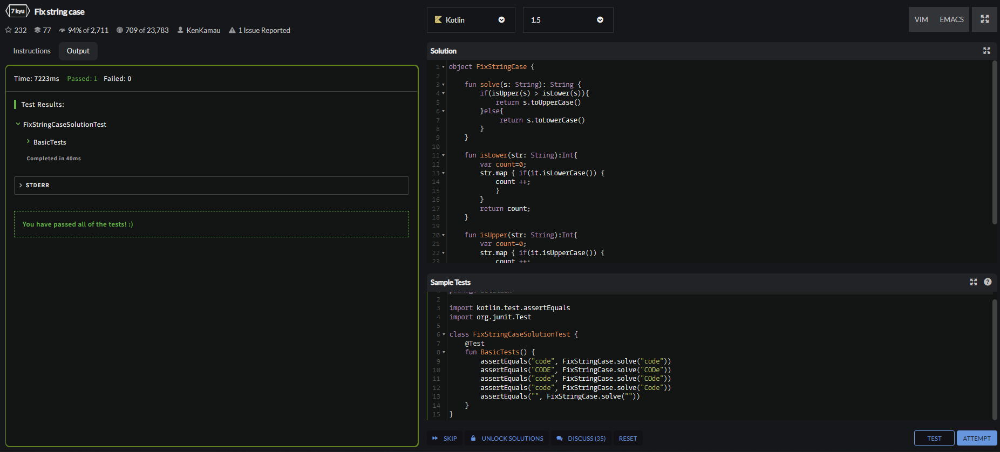
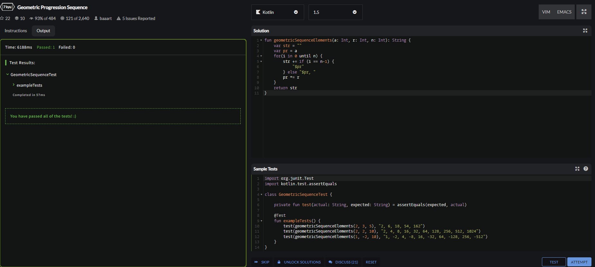
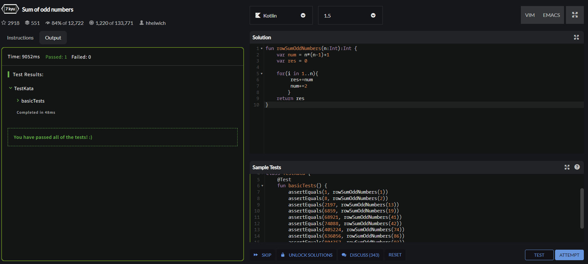

МИНИСТЕРСТВО НАУКИ И ВЫСШЕГО ОБРАЗОВАНИЯ
РОССИЙСКОЙ ФЕДЕРАЦИИ
ФЕДЕРАЛЬНОЕ ГОСУДАРСТВЕННОЕ БЮДЖЕТНОЕ
ОБРАЗОВАТЕЛЬНОЕ УЧРЕЖДЕНИЕ ВЫСШЕГО ОБРАЗОВАНИЯ
«САХАЛИНСКИЙ ГОСУДАРСТВЕННЫЙ УНИВЕРСИТЕТ»

      

 Институт естественных наук и техносферной безопасности   Кафедра информатики   Пашаян Самвел Алексанович 

   

 Лабораторная работа №6   «Версии Android SDK и совместимость»   01.03.02 Прикладная математика и информатика

            

 Научный руководитель  
Соболев Евгений Игоревич

   

 г. Южно-Сахалинск   2023г.

***
# 
 1. Вывод версии Android на устройстве. 

Добавьте в макет GeoQuiz виджет TextView для вывода уровня API устройства, на котором работает программа.
***
## 
 РЕШЕНИЕ 

        versionText=findViewById(R.id.sdkVersionText)
        versionText.setText("SdkVersion is: "+android.os.Build.VERSION.SDK_INT.toString())

# 
 2.Ограничение подсказок 

Ограничьте пользователя тремя подсказками. Храните информацию о том, сколько раз пользователь подсматривал ответ, и выводите количество оставшихся подсказок под кнопкой. Если ни одной подсказки не осталось, то кнопка получения подсказки блокируется.
***
## 
 РЕШЕНИЕ 

В файле "quizeViewModel.kt" я добавил переменную и 2 метода, один возвращает количество оставшихся подсказок, а второй уменьшает число подсказок

        private var promptCounter=3

        val currentPromptCount:Int
        get()=promptCounter

        fun promtUsed(){
        promptCounter=promptCounter-1
    }

В файле головном файле "MainActivity.kt" изменил метод который обрабатывает результат выполнения 2 Activity, если подсказка была использована, то уменьшаем оставшееся кол-во, для кнопки "cheatbutton" устанавливаем состояние Enable false, если кол-во подсказок >=0 , а также выводим кол-во оставшихся подсказок.

        override fun onActivityResult(requestCode: Int,
                                        resultCode: Int,
                                        data: Intent?) {
                super.onActivityResult(requestCode, resultCode, data)
                if (resultCode != Activity.RESULT_OK) {
                    return
                }
                if (requestCode == REQUEST_CODE_CHEAT) {
                    //quizViewModel.questionBank[quizViewModel.currentIndex].usedCheat  =
                        //data?.getBooleanExtra(EXTRA_ANSWER_SHOWN, false) ?: false
                    if(data?.getBooleanExtra(EXTRA_ANSWER_SHOWN,false) == true){
                        quizViewModel.promtUsed()
                    }
                    cheatButton.setEnabled(quizViewModel.currentPromptCount>0)
                    promptCountText.setText("Prompt left: "+quizViewModel.currentPromptCount)

                }
            }

## 
 CodeWars 

## 
 ВЫВОД 
   
Итогом работы стало создание Android приложения, которое отслеживает лазейки для читера и следит, чтобы пользователь не читерил хотя бы в 1 вопросе, ведь в таком случае он считается читером по всем вопросам. Это позволяет сделать вывод, что цель данной лабораторной работы успешно достигнута.
***    
